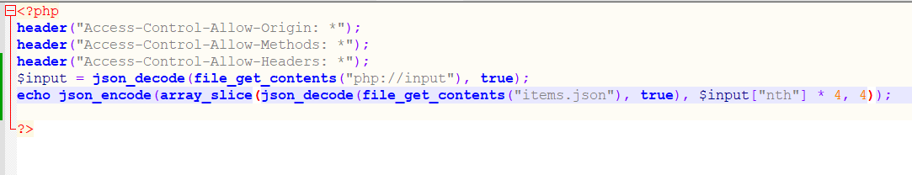
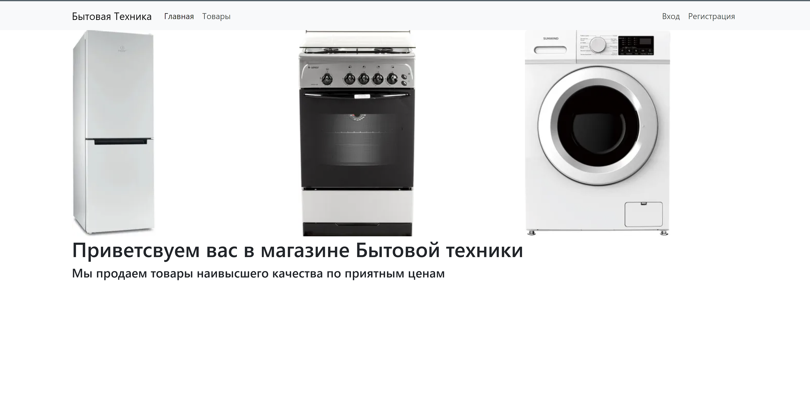
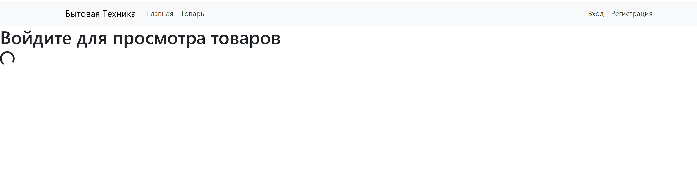
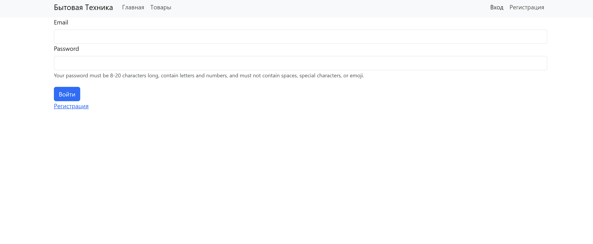
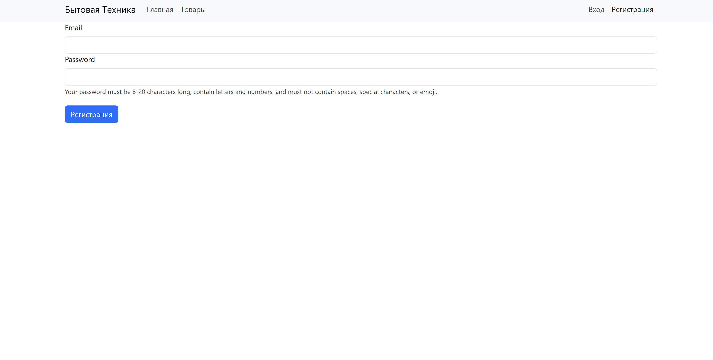
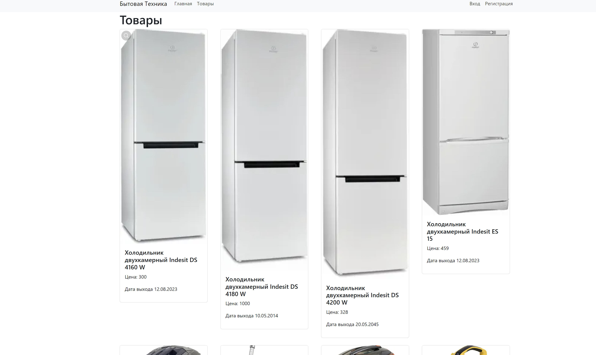
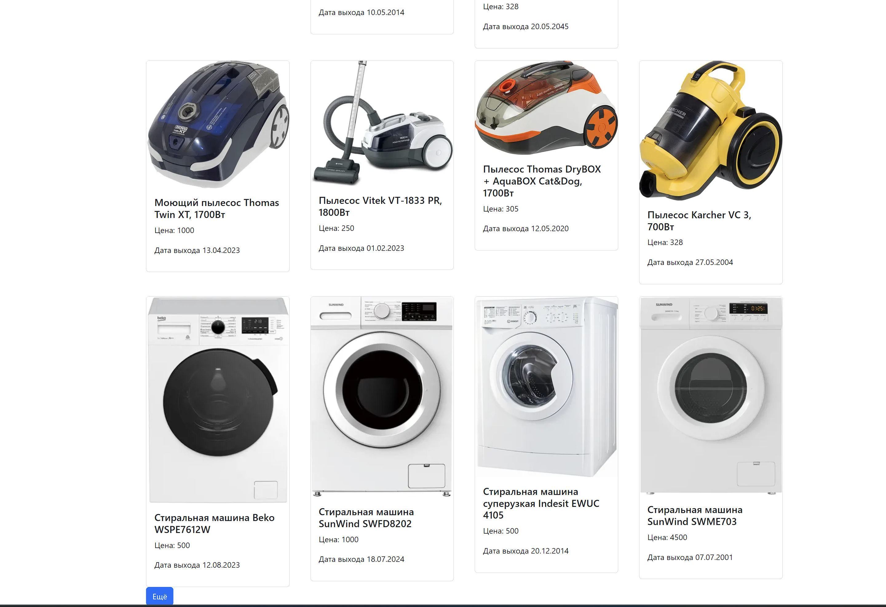

```
npx create-react-app
```

Создался шаблон react app. Запустил

```
npm start
```

Сделал свой сервер с json файлом товаров и кодом обработчиком. Прикрепляю сервер с файлом в архив.

Вот фотографии самого сайта:








После успешной регистрации и входа, можно попасть во вкладку товары

\
Поддерживается пагинация, после нажатия кнопки еще, товары подгружаются




Выполнил команды
```
npm run build
serve -s build
```
